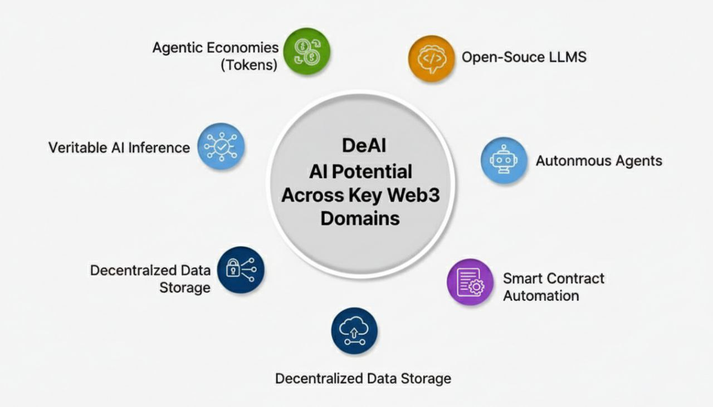

  

# 🌐 Decentralized AI & Web3 Convergence Stack

A curated repository of high-impact resources at the intersection of **Artificial Intelligence** and **Blockchain Technology**. This collection focuses on data sovereignty, decentralized infrastructure (DeAI), and Autonomous Agents.

---

## 🏗️ 1. DeAI Infrastructure & Open-Source Models
*Essential frameworks to run and deploy models without centralized gatekeepers.*

* **[Llama.cpp](https://github.com/ggerganov/llama.cpp)**: The foundation for local/decentralized LLM inference. It's the most critical repo for DeAI.
* **[Open-LLMs by Eugene Yan](https://github.com/eugeneyan/open-llms)**: A robust, frequently updated list of LLMs with permissive licenses.
* **[LocalLLM Guide](https://github.com/prompthero/local-llm-guide)**: Practical resources on how to host your own intelligence, a core Web3 requirement.

## 🤖 2. Autonomous Agents & Web3 Composability
*Frameworks to build AI Agents that can eventually manage wallets and on-chain tasks.*

* **[LangChain Main Repo](https://github.com/langchain-ai/langchain)**: The industry standard. If you build an AI agent for Web3, you will likely start here.
* **[AutoGPT](https://github.com/Significant-Gravitas/AutoGPT)**: The pioneer of autonomous AI agents. Highly relevant for decentralized automated governance.
* **[BabyAGI](https://github.com/yoheinakajima/babyagi)**: A simplified, task-driven autonomous agent perfect for understanding agentic logic in crypto.

## 💾 3. Intelligent Data Layer
*How data is structured and stored for decentralized intelligence.*

* **[Qdrant](https://github.com/qdrant/qdrant)**: A high-performance vector search engine. Vectors are the "memory" of AI; Qdrant is often used in decentralized setups.
* **[Awesome-Vector-Database](https://github.com/rossant/awesome-vector-databases)**: A meta-list of storage solutions for AI data, including decentralized options.

---

## 🛠️ My Research Thesis
I am currently exploring the **Agentic Economy**: how AI agents will use stablecoins and smart contracts to pay for their own compute and data.

---
*Curated for the Web3 community. Verified 2025.*
